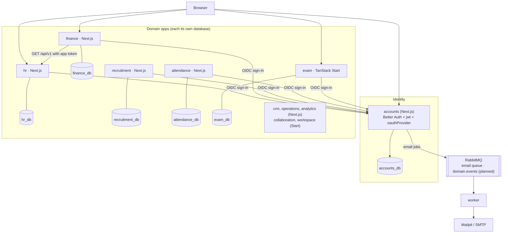

# Architecture

The company platform: one **pnpm + Turborepo** monorepo with a central identity app (`accounts`),
one application per business domain, and a background `worker`. Conventional apps run on
**Next.js 15**, highly interactive ones on **TanStack Start**. Every app signs in through
`accounts` over **OpenID Connect**, owns its **own database**, and reaches other domains only
through their APIs or events.

> **State (2026-10-07):** this page describes the agreed target (decisions D17–D20). Built today:
> `accounts`, `worker`, `hr`, `finance`, each domain on its own database, Finance reading HR
> through HR's API with an app token; `recruitment`, `attendance`, `exam` scaffolded (sign-in only,
> `exam` still on Next.js). Next: global sign-out ([roadmap](docs/roadmap.md) step 2). Progress:
> [build log](docs/build-log.md).

---

## 1. Applications

| App             | Framework             | Port  | Owns                                                      | State                 |
| :-------------- | :-------------------- | :---- | :-------------------------------------------------------- | :-------------------- |
| `accounts`      | Next.js + Better Auth | 5011  | Users, passwords, sessions, OIDC clients and tokens, JWKS | Built                 |
| `hr`            | Next.js               | 5010  | Employees, departments, positions, company administration | Built (reference app) |
| `finance`       | Next.js               | 5013  | Payroll, accounting                                       | Built (payroll)       |
| `recruitment`   | Next.js               | 5014  | Candidates, hiring                                        | Scaffolded            |
| `attendance`    | Next.js               | 5015  | Attendance, schedules, time tracking                      | Scaffolded            |
| `exam`          | TanStack Start        | 5016  | Exams, attempts, results                                  | Scaffolded on Next.js |
| `crm`           | Next.js               | 5017* | Customers, contacts, leads                                | Planned               |
| `operations`    | Next.js               | 5018* | Operational workflows                                     | Planned               |
| `analytics`     | Next.js               | 5019* | Aggregated reporting data only                            | Planned               |
| `collaboration` | TanStack Start        | 5020* | Communication, realtime collaboration                     | Planned               |
| `workspace`     | TanStack Start        | 5021* | Projects, tasks, documents                                | Planned               |
| `worker`        | Express + amqplib     | 5012  | Nothing persistent; sends email jobs                      | Built                 |

\* proposed ports. Infrastructure: PostgreSQL 16 on 5000, RabbitMQ on 5001 (UI 5002), Mailpit SMTP
5003 (UI 5004). Framework reasons: [docs/company-stack.md](docs/company-stack.md).

---

## 2. Overview



---

## 3. Rules

1. **Identity lives only in `accounts`.** Apps never store passwords or create independent users;
   they keep a shadow user linked to the accounts `sub`.
2. **Each domain owns its database.** Only the owning app connects to `<app>_db`; Postgres enforces
   it (role per domain, `CONNECT` revoked from others). No `admin_db`: administration is HR's.
3. **No SQL across domains.** Reads go through the owner's `/api/v1` with an accounts-issued app
   token (D18); later through read models fed by events (D16). Writes to another domain go through
   its API or an event, never its tables.
4. **No shared business code.** Shared packages are technical only (`core`, `ui`, later auth/OIDC
   helpers). Never import another domain's `-db` package.
5. **Independent apps first, microservices when justified.** Every app can already be deployed on
   its own, and any database can move to its own server without untangling.

---

## 4. Authentication

`accounts` is the single source of truth for identity and the only OIDC provider.

- **Sign-in:** authorization code + PKCE. The app calls `signIn.social({ provider: "accounts" })`,
  accounts shows `/login` (resumed through a signed `oauth_query`), the app exchanges the code
  (`client_secret_basic`), reads userinfo, upserts its shadow user, and creates its own session.
  Returning users skip `/login`: one click.
- **Authorization** is per app: accounts says who the user is; each domain decides what they may do.
- **Sign-out:** today, "sign out everywhere" ends the current app and the accounts session.
  **Required (D19):** every app's session ends too, via back-channel logout (roadmap step 2).
- **App-to-app (D18):** a calling app gets a JWT from accounts with the client-credentials grant,
  audience = the owner's API, scoped (`hr:employees.read`); the owner verifies it with accounts'
  JWKS.
- **Cookies:** one `cookiePrefix` per app (`accounts`, `hr`, …) because all apps share a cookie jar
  on localhost. Sessions are never shared across apps (D1).

Full flows, endpoints and gotchas: [docs/auth-flows.md](docs/auth-flows.md).

---

## 5. Data

| Database       | Owner          | Contents                                                                                                                                                                                                        |
| :------------- | :------------- | :-------------------------------------------------------------------------------------------------------------------------------------------------------------------------------------------------------------- |
| `accounts_db`  | accounts       | Better Auth core (`user`, `session`, `account`, `verification`), `jwks`, `oauthClient`, `oauthAccessToken`, `oauthRefreshToken`, `oauthConsent`, `oauthResource`, `oauthClientResource`, `oauthClientAssertion` |
| `hr_db`        | hr             | Shadow users + HR sessions; `departments`, `employees` (salary private to HR)                                                                                                                                   |
| `finance_db`   | finance        | Shadow users + sessions; `payroll_entries` (HR employee id, no foreign key)                                                                                                                                     |
| `<app>_db`     | each other app | Shadow users + sessions; domain tables as features land                                                                                                                                                         |
| `analytics_db` | analytics      | Aggregates and history derived from events; never the source of truth                                                                                                                                           |

Each database has one Prisma 7 package (`@workspace/<app>-db`, `@prisma/adapter-pg`) with its own
migration history. Better Auth models are generated with `pnpm auth:schema`.

---

## 6. Async work

- **Email (built):** accounts publishes typed jobs (`verify-email`, `reset-password`) to the
  durable quorum queue `email`; `worker` renders escaped HTML and sends via SMTP. Failed sends back
  off (2–16 s), then go to `email.dlq` after 5 deliveries; malformed jobs go there at once.
- **Domain events (D16, planned):** topic exchange `domain.events`, versioned names
  (`recruitment.candidate.hired.v1`), outbox in the publisher's database, inbox in the consumer's,
  one worker process per consuming domain.

---

## 7. Repository layout

```
apps/
  accounts/   hr/   finance/   recruitment/   attendance/   exam/   worker/
packages/
  accounts-db/  hr-db/  finance-db/  recruitment-db/  attendance-db/  exam-db/
  core/        env parsing, service URLs, queue types + producer
  ui/          shared React components + Tailwind preset
docker/postgres/init.sql   databases and roles (dev)
docker-compose.yml         Postgres, RabbitMQ, Mailpit
docs/                      see README
```

Inside a Next domain app (`apps/hr` is the reference):

```
src/app/            landing (/), sso/start, (app)/dashboard, (app)/<feature>, api/auth, api/health, api/<feature>
src/features/<x>/   schema.ts (Zod, shared by form and API), server.ts (data access),
                    queries.ts (TanStack Query), <X>Table.tsx, Create<X>Form.tsx, <X>View.tsx
src/lib/            auth.ts, auth-client.ts, session.ts (requireAuth), api.ts (requireApiSession),
                    config.server.ts, sso.ts
```

---

## 8. Security

1. Separate secrets per app; compromising one app cannot forge another's sessions.
2. Hashed OAuth client secrets in `accounts_db`.
3. PKCE + state; exact redirect and post-logout URI matching; ID-token verification required.
4. Signed login resume; same-origin-only `redirectTo`.
5. No account enumeration on sign-up and reset.
6. Database-checked sessions on every protected page and route handler.
7. Database isolation per domain, enforced by Postgres roles.
8. Scoped, audience-bound, short-lived app tokens for app-to-app calls, verified with JWKS.
9. Rate limiting in memory per process; move to shared storage before scaling out.
10. Emails rendered worker-side with escaped values; auth links never logged in production.

Decisions and their reasons: [docs/decisions.md](docs/decisions.md).
