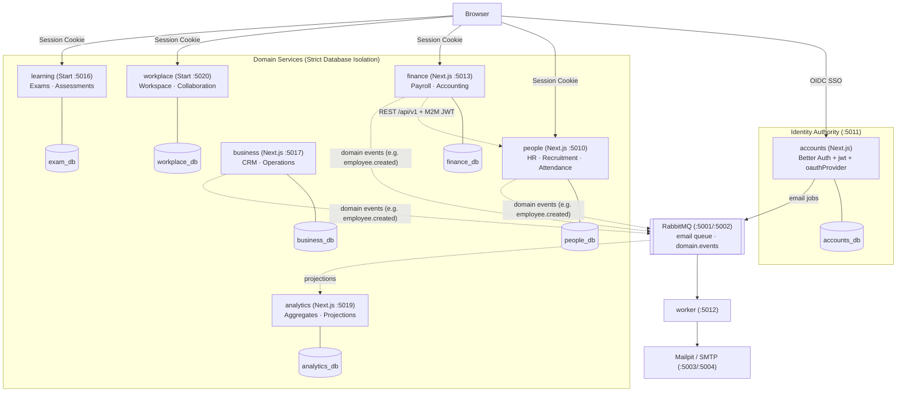

# Architecture

The company platform: one **pnpm + Turborepo** monorepo with a central identity app (`accounts`),
one application per business domain, and a background `worker`. Conventional apps run on
**Next.js 15**, highly interactive ones on **TanStack Start**. Every app signs in through
`accounts` over **OpenID Connect**, owns its **own database**, and reaches other domains only
through their APIs or events.

> **State (2026-10-07):** this page describes the agreed production architecture
> (decisions D17–D21). The platform is organized around high-cohesion **Bounded Contexts**
> with strict database isolation (`packages/<context>-db`), OAuth2 Client Credentials M2M tokens,
> and RabbitMQ domain events.

---

## 1. Applications & Bounded Contexts

| Bounded Context     | Framework         | Port | Responsibility & Sub-domains                                    | Database Package & DB                      |
| :------------------ | :---------------- | :--- | :-------------------------------------------------------------- | :----------------------------------------- |
| `accounts`          | Next.js 15        | 5011 | Identity, users, passwords, sessions, OIDC authority, JWKS      | `@workspace/accounts-db` (`accounts_db`)   |
| `people` (`hr`)     | Next.js 15        | 5010 | Employees, departments, recruitment, attendance, administration | `@workspace/people-db` (`people_db`)       |
| `finance`           | Next.js 15        | 5013 | Payroll, accounting, invoicing, ledgers                         | `@workspace/finance-db` (`finance_db`)     |
| `business` (`crm`)  | Next.js 15        | 5017 | Customers, deals, contacts, operational workflows               | `@workspace/business-db` (`business_db`)   |
| `workplace`         | TanStack Start    | 5020 | Workspace projects, tasks, documents, realtime collaboration    | `@workspace/workplace-db` (`workplace_db`) |
| `learning` (`exam`) | TanStack Start    | 5016 | Exams, tests, question banks, assessment attempts               | `@workspace/exam-db` (`exam_db`)           |
| `analytics`         | Next.js 15        | 5019 | Aggregated reporting data, event projections only               | `@workspace/analytics-db` (`analytics_db`) |
| `worker`            | Node.js (Express) | 5012 | Background email delivery, queue consumers                      | _No domain DB (Broker only)_               |

Infrastructure: PostgreSQL 16 on 5000, RabbitMQ on 5001 (UI 5002), Mailpit SMTP 5003 (UI 5004). Framework choices: [docs/company-stack.md](docs/company-stack.md).

---

## 2. Overview & Communication Boundaries



---

## 3. Architectural Rules

1. **Identity lives only in `accounts`.** Apps never store passwords or create independent users; they keep a shadow user linked to the accounts `sub`.
2. **Each domain owns its database.** Only the owning app connects to its database; Postgres enforces it at the engine level (`REVOKE CONNECT`).
3. **Database packages (`packages/<context>-db`) are private infrastructure boundaries:**
   - They contain **only** Prisma schemas, migrations, and the raw client.
   - Zero business logic lives in `-db` packages.
   - **Never cross-import `-db` packages:** `apps/people` may never import `@workspace/finance-db` (enforced via ESLint).
4. **Synchronous vs. Asynchronous Communication:**
   - **Use REST + M2M JWT** when the caller needs an **immediate answer** (e.g. Finance queries People: _"Is employee X active?"_). App tokens are issued by `accounts` via OAuth Client Credentials and verified locally using JWKS.
   - **Use RabbitMQ events** when the caller announces an **immutable fact** (e.g. `People` publishes `employee.created.v1`). The caller does not know or wait for consumers.
5. **Clear Extraction Path:**
   - Start with high-cohesion bounded contexts to enable fast internal atomic transactions (e.g. `Candidate` hired → `Employee` created in one `people_db` transaction).
   - If a sub-domain (such as Recruitment) experiences explosive growth or needs dedicated scaling, extract it into its own independent app (`apps/recruitment`) and database (`packages/recruitment-db`) without restructuring the rest of the system.

6. **Independent apps first, microservices when justified.** Every app can already be deployed on
   its own, and any database can move to its own server without untangling.

---

## 4. Authentication

`accounts` is the single source of truth for identity and the only OIDC provider.

- **Sign-in:** authorization code + PKCE. The app calls `signIn.social({ provider: "accounts" })`,
  accounts shows `/login` (resumed through a signed `oauth_query`), the app exchanges the code
  (`client_secret_basic`), reads userinfo, upserts its shadow user, and creates its own session.
  Returning users skip `/login`: one click.
- **Authorization** is per app: accounts says who the user is; each domain decides what they may do.
- **Sign-out (D19):** one "Sign out" in any app ends that app's session and the accounts session;
  accounts then sends an OIDC back-channel logout token to every other app the user signed in to,
  and each deletes the user's sessions.
- **App-to-app (D18):** a calling app gets a JWT from accounts with the client-credentials grant,
  audience = the owner's API, scoped (`hr:employees.read`); the owner verifies it with accounts'
  JWKS.
- **Cookies:** one `cookiePrefix` per app (`accounts`, `hr`, …) because all apps share a cookie jar
  on localhost. Sessions are never shared across apps (D1).

Full flows, endpoints and gotchas: [docs/auth-flows.md](docs/auth-flows.md).

---

## 5. Data

| Database       | Owner          | Contents                                                                                                                                                                                                        |
| :------------- | :------------- | :-------------------------------------------------------------------------------------------------------------------------------------------------------------------------------------------------------------- |
| `accounts_db`  | accounts       | Better Auth core (`user`, `session`, `account`, `verification`), `jwks`, `oauthClient`, `oauthAccessToken`, `oauthRefreshToken`, `oauthConsent`, `oauthResource`, `oauthClientResource`, `oauthClientAssertion` |
| `hr_db`        | hr             | Shadow users + HR sessions; `departments`, `employees` (salary private to HR)                                                                                                                                   |
| `finance_db`   | finance        | Shadow users + sessions; `payroll_entries` (HR employee id, no foreign key)                                                                                                                                     |
| `<app>_db`     | each other app | Shadow users + sessions; domain tables as features land                                                                                                                                                         |
| `analytics_db` | analytics      | Aggregates and history derived from events; never the source of truth                                                                                                                                           |

Each database has one Prisma 7 package (`@workspace/<app>-db`, `@prisma/adapter-pg`) with its own
migration history. Better Auth models are generated with `pnpm auth:schema`.

---

## 6. Async work

- **Email (built):** accounts publishes typed jobs (`verify-email`, `reset-password`) to the
  durable quorum queue `email`; `worker` renders escaped HTML and sends via SMTP. Failed sends back
  off (2–16 s), then go to `email.dlq` after 5 deliveries; malformed jobs go there at once.
- **Domain events (D16, planned):** topic exchange `domain.events`, versioned names
  (`recruitment.candidate.hired.v1`), outbox in the publisher's database, inbox in the consumer's,
  one worker process per consuming domain.

---

## 7. Repository layout

```
apps/
  accounts/   hr/   finance/   recruitment/   attendance/   exam/   worker/
packages/
  accounts-db/  hr-db/  finance-db/  recruitment-db/  attendance-db/  exam-db/
  core/        env parsing, service URLs, queue types + producer
  ui/          shared React components + Tailwind preset
docker/postgres/init.sql   databases and roles (dev)
docker-compose.yml         Postgres, RabbitMQ, Mailpit
docs/                      see README
```

Inside a Next domain app (`apps/hr` is the reference):

```
src/app/            landing (/), sso/start, (app)/dashboard, (app)/<feature>, api/auth, api/health, api/<feature>
src/features/<x>/   schema.ts (Zod, shared by form and API), server.ts (data access),
                    queries.ts (TanStack Query), <X>Table.tsx, Create<X>Form.tsx, <X>View.tsx
src/lib/            auth.ts (getAuth), auth-client.ts, session.ts (requireAuth), api.ts
                    (requireApiSession), config.server.ts, sso.ts
```

Inside a TanStack Start app (`apps/exam` is the reference):

```
vite.config.ts      tanstackStart() + nitro() + react; port 5016
src/router.tsx      router factory (QueryClient in context)
src/routes/         __root.tsx (document shell), index.tsx (landing), sso/start.tsx,
                    _app.tsx (pathless guarded layout, beforeLoad), _app/dashboard.tsx,
                    api/auth/$.ts, api/health.ts, api/backchannel-logout.ts (server routes)
src/server/         session.ts (createServerFn), session.server.ts (server-only helpers)
src/lib/            same as the Next apps: auth.ts (getAuth, tanstackStartCookies), auth-client.ts,
                    config.server.ts, sso.ts
```

---

## 8. Security

1. Separate secrets per app; compromising one app cannot forge another's sessions.
2. Hashed OAuth client secrets in `accounts_db`.
3. PKCE + state; exact redirect and post-logout URI matching; ID-token verification required.
4. Signed login resume; same-origin-only `redirectTo`.
5. No account enumeration on sign-up and reset.
6. Database-checked sessions on every protected page and route handler.
7. Database isolation per domain, enforced by Postgres roles.
8. Scoped, audience-bound, short-lived app tokens for app-to-app calls, verified with JWKS.
9. Rate limiting in memory per process; move to shared storage before scaling out.
10. Emails rendered worker-side with escaped values; auth links never logged in production.

Decisions and their reasons: [docs/decisions.md](docs/decisions.md).
