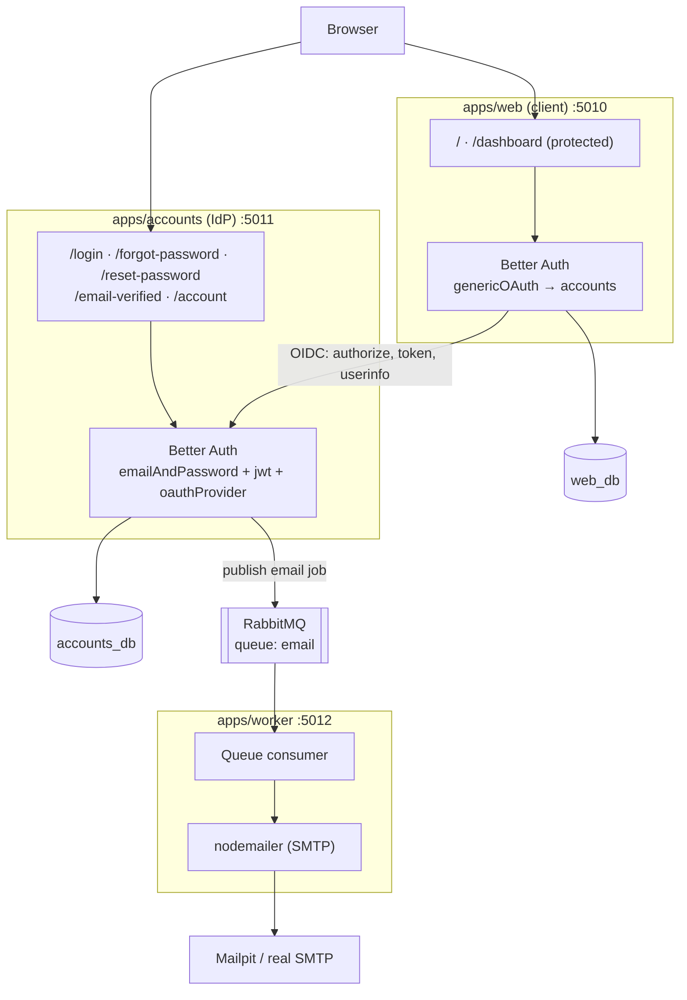
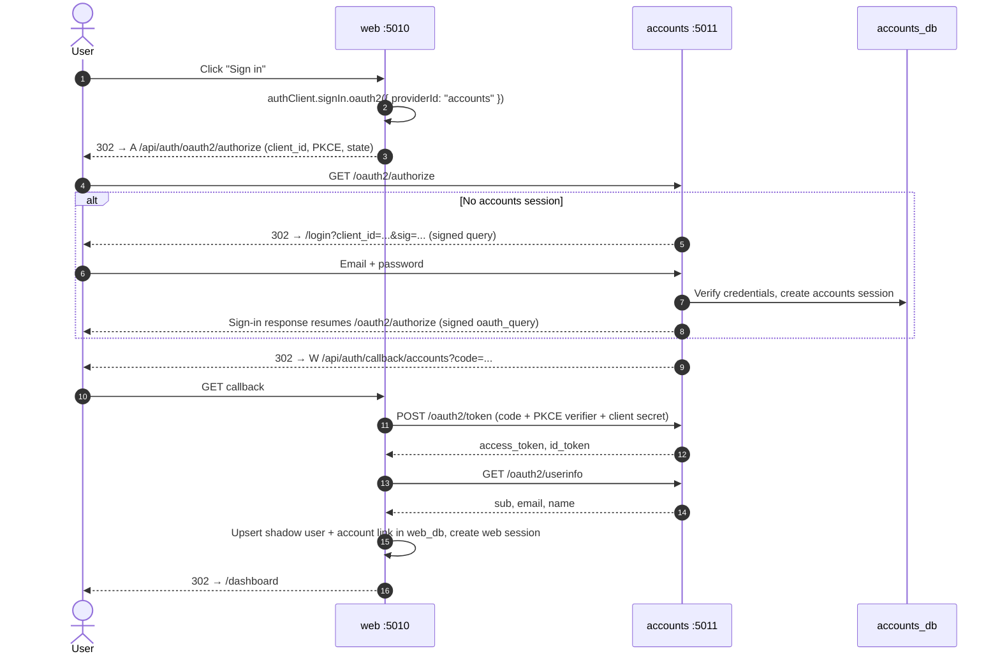

# System Architecture & Implementation Plan

`next-tanstack-framework-template` is a multi-service starter: several **Next.js 15** apps
and a background **worker**, kept in one **pnpm + Turborepo** monorepo. A central `accounts` service
owns identity; every other app signs users in through it with **OAuth 2.0 / OpenID Connect**, the
same pattern as the philgeps workspace, built on Next.js instead of TanStack Start.

It is the multi-service counterpart of `next-betterAuth-monolith-template`, which stays unchanged.

> **Status:** phases 1–4 built (root, shared packages, databases, `accounts`); `worker` and `web` next. Progress per phase: [implementation plan](docs/implementation-plan.md).
> Detailed docs live in [`docs/`](docs/); see the [README](README.md#documentation).

---

## 1. Services

| Service    | Stack                | Port | Responsibility                                                            |
| :--------- | :------------------- | :--- | :------------------------------------------------------------------------ |
| `accounts` | Next.js + Better Auth | 5011 | Identity provider (IdP). Users, passwords, sign-up, verification, reset.  |
| `web`      | Next.js + Better Auth | 5010 | Example client app. Signs in via `accounts`, owns its own data.           |
| `worker`   | Express + amqplib    | 5012 | Consumes background jobs (emails) from RabbitMQ, sends via SMTP.          |

| Infrastructure | Port (host)              | Purpose                                         |
| :------------- | :----------------------- | :---------------------------------------------- |
| PostgreSQL 16  | 5000                     | One server, one database per service.           |
| RabbitMQ       | 5001 (UI: 5002)         | Job queue between services.                     |
| Mailpit        | 5003 SMTP (UI: 5004)     | Catches all outgoing email in development.      |

Host ports are offset from the defaults (and from philgeps) so both stacks can run side by side.

---

## 2. High-Level Diagram



**Rules that keep the services independent**

1. Each service owns its database. No service reads another's tables.
2. Services talk over HTTP (OIDC) or the queue only, never by importing each other's code.
3. Shared code lives in `packages/` and holds no service-specific state.

---

## 3. Authentication Flow (SSO)

`accounts` is the single source of truth for identity. `web` keeps only a **shadow user** (id, name,
email) and its own session, created from the OIDC handshake.



Full step-by-step flows, endpoint tables, and session rules: [docs/auth-flows.md](docs/auth-flows.md).

**Sign-out:** `web` clears its own session. The `accounts` session stays (true SSO: the next
"Sign in" is one click). A "sign out everywhere" option can call the `accounts` end-session endpoint.

**Cookies:** browsers scope cookies by host, not port, so on `localhost` both apps share a cookie
jar. Each app sets its own `advanced.cookiePrefix` (`accounts`, `web`) so their session cookies
never collide. In production they live on separate subdomains.

### Flows owned by `accounts` (ported from the monolith template)

- **Sign-up:** create user → publish `verify-email` job → no session until the link is clicked.
- **Email verification:** `/api/auth/verify-email` → auto sign-in → `/email-verified`.
- **Password reset:** `/forgot-password` → publish `reset-password` job → `/reset-password?token=…`
  → new password, all sessions revoked.
- **Rate limiting:** stricter rules on sign-in, sign-up, reset, and verification resend.

---

## 4. Email / Job Flow

```mermaid
sequenceDiagram
    participant A as accounts (Better Auth hook)
    participant P as @workspace/core/queue/producer
    participant MQ as RabbitMQ (durable queue "email")
    participant W as worker
    participant S as SMTP (Mailpit)

    A->>P: publishEmail({ template: "reset-password", to, data: { url } })
    P->>MQ: sendToQueue (persistent)
    MQ->>W: deliver (prefetch 5)
    W->>W: Render template (values HTML-escaped)
    W->>S: sendMail
    W->>MQ: ack (nack on failure; after 5 deliveries RabbitMQ moves it to email.dlq)
```

- Jobs are typed in `@workspace/core/queue/types`, so producer and consumer agree on payloads.
- Templates live in the worker. A job carries a template name and data, never raw HTML.
- If the broker is down, `accounts` logs the failure instead of throwing, so a sign-up is never
  half-completed because email could not be queued.

---

## 5. Repository Layout

```
next-tanstack-framework-template/
├── apps/
│   ├── accounts/            Next.js IdP
│   │   └── src/
│   │       ├── app/         login, forgot/reset password, email-verified, account, api/auth
│   │       ├── components/  LoginForm, ForgotPasswordForm, ResetPasswordForm
│   │       └── lib/         auth.ts, auth-client.ts, session.ts, config.server.ts
│   ├── web/                 Next.js client app
│   │   └── src/
│   │       ├── app/         landing, dashboard (protected), api/auth
│   │       └── lib/         auth.ts (genericOAuth), auth-client.ts, session.ts
│   └── worker/              Express + RabbitMQ consumer
│       └── src/             index.ts, server.ts (health), consumer.ts, email/
├── packages/
│   ├── accounts-db/         Prisma 7 schema + client (users, sessions, OAuth clients/tokens, JWKS)
│   ├── web-db/              Prisma 7 schema + client (shadow users, sessions)
│   ├── core/                Zod env parsing, service URLs, queue types + producer
│   └── ui/                  Button, Card, Input, cn()
├── docker/postgres/init.sql Creates accounts_db and web_db
├── docker-compose.yml       Postgres, RabbitMQ, Mailpit
├── turbo.json · pnpm-workspace.yaml · .env.example
```

---

## 6. Data Model

**accounts_db** (Better Auth core + `jwt` + `oauthProvider` plugin tables)

| Table                                    | Purpose                                            |
| :--------------------------------------- | :------------------------------------------------- |
| `user`, `session`, `account`             | Identity, sessions, password hashes.               |
| `verification`                           | Email-verification and password-reset tokens.      |
| `jwks`                                   | Keys used to sign ID tokens.                       |
| `oauthClient`                            | Registered client apps (`web`), secret stored hashed. |
| `oauthAccessToken`, `oauthRefreshToken`  | Issued tokens.                                     |
| `oauthConsent`                           | Consent records (first-party clients skip consent). |
| `oauthClientAssertion`, `oauthResource`  | Added by oauth-provider 1.7 (client-assertion replay guard, resource indicators). |

The exact columns are generated from the plugins with the Better Auth CLI (`pnpm auth:schema` in each database package).

**web_db** (Better Auth core only)

| Table                     | Purpose                                                       |
| :------------------------ | :------------------------------------------------------------ |
| `user`                    | Shadow copy of the accounts user, refreshed on every sign-in. |
| `session`                 | `web`'s own sessions.                                         |
| `account`                 | Link to the `accounts` provider (stores the OIDC tokens).     |
| `verification`            | OAuth state for the handshake.                                |

New app features add their tables to `web_db`, keyed to the shadow `user.id`.

---

## 7. Configuration

One `.env` at the repo root. Next apps load it through `dotenv -e ../../.env` in their scripts; Prisma configs
and the worker load it explicitly. Every service validates its own variables with Zod at startup and
refuses to boot when a secret is missing or too short.

| Variable                                         | Used by          |
| :----------------------------------------------- | :--------------- |
| `NEXT_PUBLIC_ACCOUNTS_URL`, `NEXT_PUBLIC_WEB_URL` | all              |
| `ACCOUNTS_DATABASE_URL`, `ACCOUNTS_AUTH_SECRET`  | accounts         |
| `WEB_DATABASE_URL`, `WEB_AUTH_SECRET`            | web              |
| `WEB_OAUTH_CLIENT_ID`, `WEB_OAUTH_CLIENT_SECRET` | web, seed        |
| `RABBITMQ_URL`                                   | accounts, worker |
| `SMTP_*`, `WORKER_PORT`                          | worker           |

---

## 8. Security

1. **Separate secrets per service.** Compromising `web` does not let anyone forge `accounts` sessions.
2. **Hashed OAuth client secrets** in `accounts_db` (the seed hashes them; philgeps stores plaintext).
3. **PKCE + state** on the authorization-code flow; redirect URIs are matched exactly against the
   registered client.
4. **Signed login resume + open-redirect guard:** `/login` resumes an authorization request only
   when its signed `oauth_query` verifies, and `redirectTo` accepts same-origin paths only.
5. **No account enumeration:** sign-up and reset return the same response for known and unknown emails.
6. **Database-checked sessions** on protected server routes in both apps.
7. **Rate limiting** in-memory per process. Switch to Redis/database storage before scaling out.
8. **Emails rendered worker-side** with escaped values. Auth links never appear in production logs.

---

## 9. Implementation Plan

Eight phases: root tooling → shared packages → databases → `accounts` → `worker` → `web` →
verification → docs. Files, tasks, and the check that closes each phase are in
[docs/implementation-plan.md](docs/implementation-plan.md).

---

## 10. Decisions

| Decision          | Choice                         |
| :---------------- | :----------------------------- |
| Package manager   | pnpm                           |
| Next.js           | 15.5                           |
| Prisma            | 7.x with `@prisma/adapter-pg`  |
| Email templates   | Plain HTML, escaped            |
| Worker runtime    | `tsx`                          |
| Redis             | Not included in v1             |
| Framework policy  | Next.js default; TanStack libraries; TanStack Start by exception ([company-stack.md](docs/company-stack.md)) |

Reasons and rejected alternatives: [docs/decisions.md](docs/decisions.md). Differences from
philgeps-workspace: [docs/philgeps-comparison.md](docs/philgeps-comparison.md).
