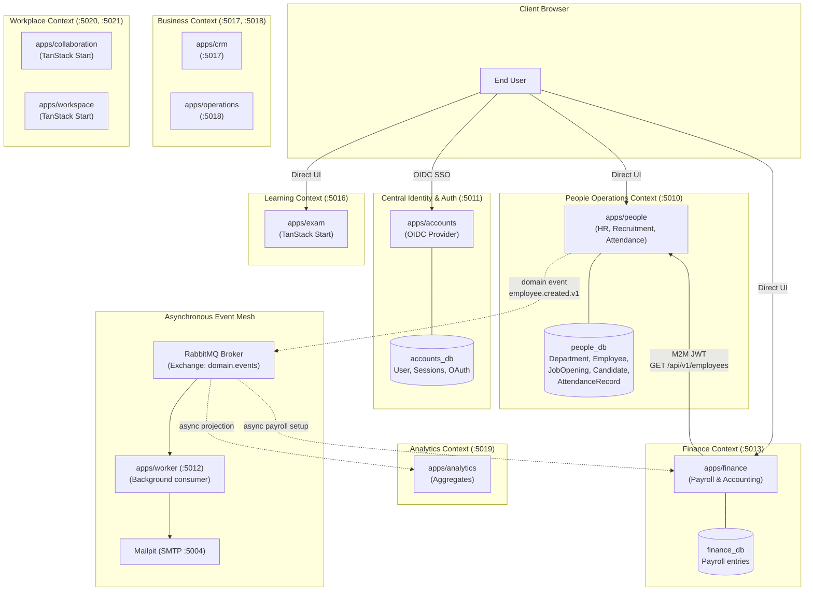
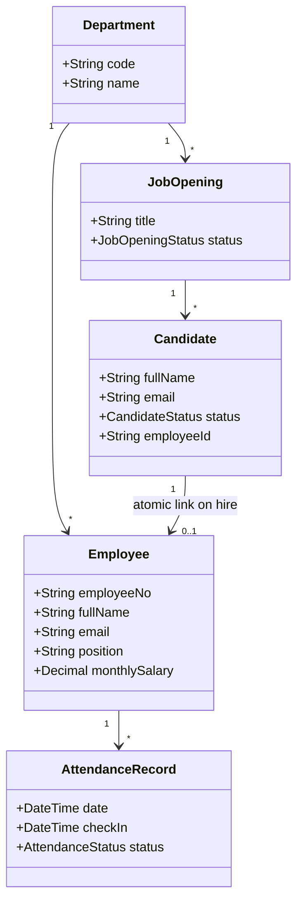
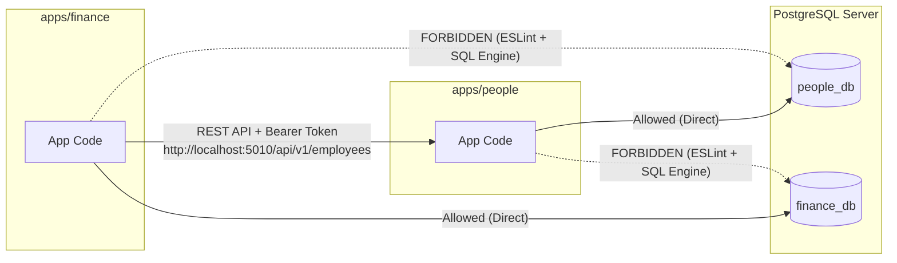
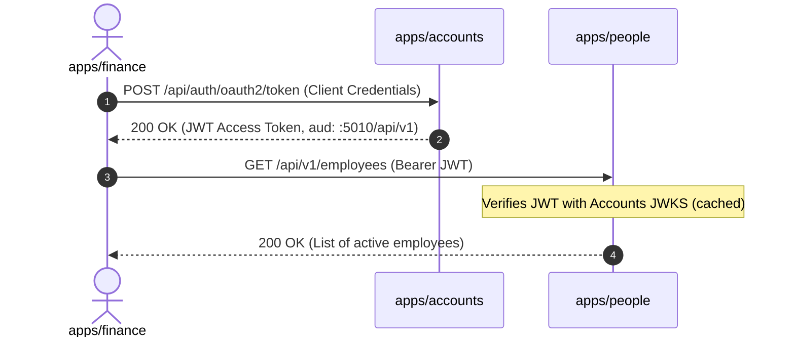

# System Architecture & Relationship Map

This document explains the architecture of the platform, the relationships between services, database isolation boundaries, and why services are structured into **Bounded Contexts** (Decision [D21](decisions.md#d21-consolidation-into-6-bounded-contexts--worker-production-grade)).

---

## 1. High-Level System Architecture



---

## 2. Why Did HR Change to `people_db`? (Understanding Bounded Contexts)

### The Problem With Over-Segmentation (Micro-App Sprawl)
Earlier, the platform had three separate micro-apps and three separate databases:
- `apps/hr` &rarr; `hr_db`
- `apps/recruitment` &rarr; `recruitment_db`
- `apps/attendance` &rarr; `attendance_db`

While this gave maximum separation, it caused serious real-world problems:
1. **Broken Transaction Boundaries:** When a candidate is hired in Recruitment, creating an Employee in HR required a 2-phase distributed commit or complex rollback logic across databases.
2. **Artificial Network Overhead:** Browsing an employee directory while checking their attendance and job application required cross-service REST queries.
3. **Database Proliferation:** Managing 11+ different databases and migration pipelines for basic operational domains.

### The Solution: The "People Operations" Bounded Context
In Domain-Driven Design (DDD), **HR, Recruitment, and Attendance share the exact same domain lifecycle**:
- A **Candidate** applies for a **Job Opening**.
- When offered the job, the candidate is **Hired**.
- **Atomically**, an **Employee** record is created and linked to the **Candidate** record.
- Daily **Attendance** records belong directly to that **Employee**.



By placing all three into `packages/people-db` and serving them via `apps/people`:
1. **Atomic Hire Transaction:** Hiring an applicant executes in a single database transaction:
   ```ts
   // apps/people/src/features/recruitment/server.ts
   await peopleDb.$transaction(async (tx) => {
     const employee = await tx.employee.create({ data: employeeData });
     await tx.candidate.update({
       where: { id: candidateId },
       data: { status: "HIRED", employeeId: employee.id, hiredAt: new Date() }
     });
     return employee;
   });
   ```
2. **No Data Loss / Desynchronization:** An employee can never exist without their candidate link, and a candidate cannot be marked `HIRED` without their employee profile being created.

---

## 3. Strict Database Isolation Boundaries

Each database is strictly owned by **one** application.



### 1. Engine-Level Enforcement (PostgreSQL)
In `docker/postgres/init.sql`:
- The user `people_app` is granted access **only** to `people_db`.
- The user `finance_app` is granted access **only** to `finance_db`.
- `REVOKE CONNECT ON DATABASE people_db FROM PUBLIC;` prevents unauthorized connections.

### 2. Code-Level Enforcement (ESLint `no-restricted-imports`)
Every application contains an automated linting rule:
```js
// apps/finance/eslint.config.mjs
"no-restricted-imports": [
  "error",
  {
    patterns: [
      {
        group: ["@workspace/*-db", "!@workspace/finance-db"],
        message: "Boundary violation: apps/finance may only import its own database package (@workspace/finance-db)."
      }
    ]
  }
]
```
If a developer accidentally attempts to `import { peopleDb } from "@workspace/people-db"` inside Finance, `pnpm lint` and CI fail immediately.

---

## 4. How Services Communicate

Services communicate in two ways, depending on whether an immediate answer is required:

### Mode A: Synchronous (REST + M2M OAuth Token)
Used when a caller needs an **immediate answer** before continuing.

**Example:** Finance runs monthly payroll and needs to know which employees are active.
1. `Finance` requests an access token from `Accounts` (:5011) using OAuth **Client Credentials**.
2. `Accounts` signs a JWT scoped to `people:employees.read` with audience `http://localhost:5010/api/v1`.
3. `Finance` sends `GET http://localhost:5010/api/v1/employees` with `Authorization: Bearer <token>`.
4. `People` validates the JWT against `Accounts`' public JWKS key set and returns the **directory read model** (excluding private data like internal salaries).



### Mode B: Asynchronous (Domain Events via RabbitMQ)
Used when a service announces an **immutable fact** and does not need to wait for consumers.

**Example:** A new employee is created in `People`.
1. `People` writes the event to a local **Transactional Outbox** in `people_db`.
2. Outbox publisher pushes `people.employee.created.v1` to RabbitMQ exchange `domain.events`.
3. `Finance` consumes the event via an **Inbox table** (deduplication) and automatically creates a payroll profile.
4. `Analytics` consumes the event and updates headcount projections.

---

## 5. Summary Matrix of Services & Databases

| Service | Port | Database | DB Package | Description |
| :--- | :--- | :--- | :--- | :--- |
| **`accounts`** | `:5011` | `accounts_db` | `@workspace/accounts-db` | Single OIDC Provider, user identity, OAuth tokens |
| **`people`** | `:5010` | `people_db` | `@workspace/people-db` | **HR records, recruitment pipeline, and daily attendance** |
| **`finance`** | `:5013` | `finance_db` | `@workspace/finance-db` | Payroll entries and accounting ledger |
| **`exam`** | `:5016` | `exam_db` | `@workspace/exam-db` | Online assessments *(TanStack Start)* |
| **`crm`** | `:5017` | `crm_db` | `@workspace/crm-db` | Customer pipeline *(Next.js)* |
| **`operations`**| `:5018` | `operations_db`| `@workspace/operations-db`| Business operational logs *(Next.js)* |
| **`analytics`** | `:5019` | `analytics_db` | `@workspace/analytics-db` | Historical aggregates derived from events |
| **`collaboration`**|`:5020`| `collaboration_db`| `@workspace/collaboration-db`| Chat channels & messaging *(TanStack Start)* |
| **`workspace`** | `:5021` | `workspace_db` | `@workspace/workspace-db` | Docs & team spaces *(TanStack Start)* |
| **`worker`** | `:5012` | None | None | Background consumer for RabbitMQ queues |
