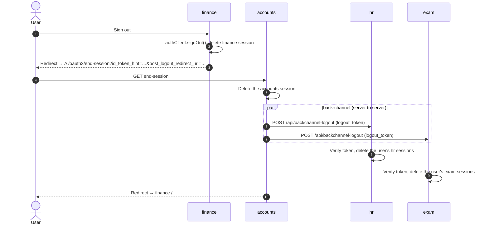
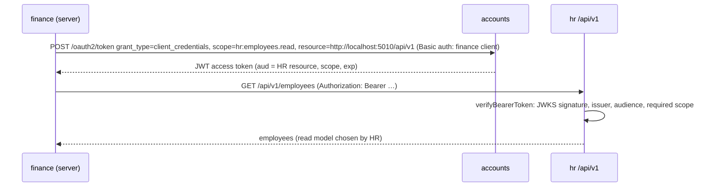
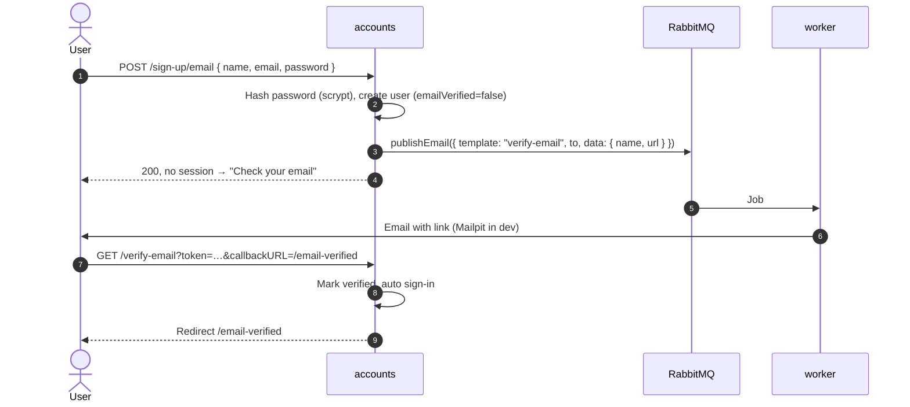

# Authentication Flows

How identity moves between `accounts` and the domain apps. Read [ARCHITECTURE.md](../ARCHITECTURE.md)
first for the service map.

| Flow                                                      | State (2026-10-07)                                                |
| :-------------------------------------------------------- | :---------------------------------------------------------------- |
| SSO sign-in (OIDC code + PKCE) for every domain app       | ✅ Built, verified for hr, finance, recruitment, attendance, exam |
| Sign out (one button, ends the app and accounts sessions) | ✅ Built                                                          |
| **Global sign-out** (every app loses its session)         | ✅ Built (D19): OIDC back-channel logout                          |
| **App-to-app calls** (finance → HR API)                   | ✅ Built (D18): client credentials, JWT, verified by HR           |
| Sign-up, verification, reset, rate limits (accounts)      | ✅ Built                                                          |

Examples use `hr` (port 5010); every domain app works the same way with its own name, port and
cookie prefix.

---

## 1. Roles

| Service                          | OAuth role                                                                   | Better Auth plugins                                                                |
| :------------------------------- | :--------------------------------------------------------------------------- | :--------------------------------------------------------------------------------- |
| `accounts`                       | Authorization server / OIDC provider                                         | `emailAndPassword`, `emailVerification`, `jwt`, `oauthProvider`, `nextCookies`     |
| Domain apps (`hr`, `finance`, …) | Relying party (OAuth client); later also resource server for their `/api/v1` | `genericOAuth`, `nextCookies` (Next.js) or `tanstackStartCookies` (TanStack Start) |

`accounts` holds the only passwords. A domain app never sees one: it receives an authorization
code, exchanges it for tokens server-to-server, and creates its own session.

---

## 2. Endpoints

All paths are under each service's `/api/auth` base.

### accounts (provider)

| Endpoint                                     | Method   | Purpose                                                           |
| :------------------------------------------- | :------- | :---------------------------------------------------------------- |
| `/.well-known/openid-configuration`          | GET      | OIDC discovery. Apps read endpoints from here.                    |
| `/oauth2/authorize`                          | GET      | Starts the authorization-code flow.                               |
| `/oauth2/token`                              | POST     | Code (+ PKCE verifier) → tokens; later also `client_credentials`. |
| `/oauth2/userinfo`                           | GET      | `sub`, `email`, `name` for an access token.                       |
| `/oauth2/end-session`                        | GET      | RP-initiated logout (ends the accounts session).                  |
| `/oauth2/revoke`, `/oauth2/introspect`       | POST     | Token revocation and introspection.                               |
| `/jwks`                                      | GET      | Public keys for verifying ID tokens and JWT access tokens.        |
| `/sign-in/email`, `/sign-up/email`           | POST     | Password sign-in and sign-up.                                     |
| `/verify-email`, `/send-verification-email`  | GET/POST | Email verification and resend.                                    |
| `/request-password-reset`, `/reset-password` | POST     | Password reset.                                                   |

Issuer: `${NEXT_PUBLIC_ACCOUNTS_URL}/api/auth`. ID tokens are EdDSA (Ed25519).

### Domain app (client)

| Endpoint                    | Method   | Purpose                                                                                                                                                                                       |
| :-------------------------- | :------- | :-------------------------------------------------------------------------------------------------------------------------------------------------------------------------------------------- |
| `/sign-in/social`           | POST     | Starts the handshake with `{ provider: "accounts" }`. Better Auth 1.7 serves genericOAuth providers through the standard social endpoint; there is no `/sign-in/oauth2` and no client plugin. |
| `/callback/accounts`        | GET      | Redirect URI registered with `accounts`.                                                                                                                                                      |
| `/get-session`, `/sign-out` | GET/POST | The app's own session.                                                                                                                                                                        |

App pages: `/` (landing), `/sso/start?redirectTo=…` (health pre-flight, then starts sign-in),
`/dashboard` and other protected pages.

---

## 3. Single sign-on (first visit)

```mermaid
sequenceDiagram
    autonumber
    actor U as User
    participant H as hr :5010
    participant A as accounts :5011

    U->>H: Open /dashboard (no session)
    H-->>U: 307 → /sso/start?redirectTo=/dashboard
    U->>H: /sso/start (server checks accounts /api/health)
    H->>H: signIn.social({ provider: "accounts", callbackURL: "/dashboard" })
    Note over H: Stores state + PKCE verifier (hr.state cookie, 10 min)
    H-->>U: Redirect → A /api/auth/oauth2/authorize?client_id=hr&code_challenge=…&state=…
    U->>A: GET /oauth2/authorize
    A->>A: No accounts session
    A-->>U: Redirect → /login?client_id=…&exp=…&sig=…
    U->>A: Email + password on /login
    Note over A: oauthProviderClient() attaches the signed query (oauth_query) to the sign-in request
    A->>A: Verify signature, password, email verified → accounts session
    A-->>U: Continue authorization → H /api/auth/callback/accounts?code=…&state=…
    U->>H: GET /callback/accounts
    H->>A: POST /oauth2/token (code, code_verifier; client_secret_basic)
    A-->>H: access_token, id_token (EdDSA)
    H->>A: GET /oauth2/userinfo
    A-->>H: { sub, email, name, email_verified }
    H->>H: Upsert shadow user + account link in hr_db, create hr session
    H-->>U: Redirect → /dashboard (hr.session_token cookie)
```

**Why the signed query matters:** `/login` cannot be tricked into resuming an authorization request
someone else crafted. `accounts` signs the original query when it redirects to `/login` and rejects
the sign-in if the signature or expiry does not verify.

**Returning visit:** if the accounts session exists, `/oauth2/authorize` redirects straight back with
a code. Every domain app is a first-party client seeded with `skipConsent: true`, so it is one click.

---

## 4. Sign-out (global, D19)

Every app has one **Sign out** button. Signing out anywhere signs the user out everywhere.



- **Trigger:** accounts sends logout tokens whenever an accounts session is deleted: end-session,
  sign-out on accounts itself, session revocation (e.g. password reset). Recipients are the clients
  holding tokens issued under that session, i.e. every app the user signed in to through it.
- **Logout token:** JWT signed with the ID-token key, `typ: logout+jwt`, `iss`, `aud` = client id,
  `sub` = accounts user id, `sid` = accounts session, back-channel `events` claim, 2-minute
  lifetime. accounts makes one delivery attempt per app (5 s timeout), as the spec says.
- **Receiver:** `POST /api/backchannel-logout` in every app (`apps/<app>/src/app/api/backchannel-logout`),
  built on `handleBackchannelLogout()` from `@workspace/core/oidc`, which verifies signature (JWKS),
  issuer, audience, `typ`, events and no `nonce`. The app then deletes **all** sessions of the user
  linked to that `sub` (it does not track which accounts session each local one came from).
  Invalid or missing tokens → 400. The URI is registered per client by the accounts seed
  (`backchannelLogoutUri`).
- Sessions are database-checked on every request (no cookie cache), so a deleted session is
  rejected on the next page load or API call.

Gotchas (verified): Better Auth builds `post_logout_redirect_uri` with `new URL()`, so it always ends
in `/`; the seed registers `${appUrl}/` to match exactly. `signOut()` follows the end-session URL
automatically unless `disableRedirect: true`. Dynamic client registration only accepts https,
public `backchannel_logout_uri`s; the seed writes the URI directly, so `http://localhost` works in
development, and delivery itself does not check the host.

---

## 5. App-to-app calls (D18)



- HR's `/api/v1/*` accepts only bearer tokens; HR's own UI keeps using session routes (`/api/employees`).
- One definition in `@workspace/core/apis`: `API_RESOURCES` (identifier = `aud`, scopes),
  `API_GRANTS` (which app may call which API). Accounts declares the resources and scopes in
  `oauthProvider`; the seed gives each calling client the `client_credentials` grant, its
  `clientCredentialsScopes`, and an `oauthClientResource` link (required:
  `enforcePerClientResources` defaults to true).
- Owner: `apps/hr/src/lib/app-token.ts` (`requireAppToken`, JWKS verification, 401/403 with the
  library's `WWW-Authenticate` challenge). Caller: `apps/finance/src/lib/hr-client.ts` (token
  cache, one retry on 401, `HrUnavailableError` → 503 "HR is unavailable").
- Verified: no token, garbage, or a token without `resource` (accounts then issues an opaque
  token) → 401; HR client asking for the grant → `unauthorized_client`; unknown scope →
  `invalid_scope`; salary never in the response.

---

## 6. Flows owned by `accounts`

Ported from `next-betterAuth-monolith-template`; email goes through the queue instead of an
in-process `sendEmail()`.

### Sign-up and email verification



- Sign-in before verifying returns `EMAIL_NOT_VERIFIED`. `/login` offers a resend button.
- A duplicate sign-up gets the same response as a new one, so emails cannot be enumerated.
- If sign-up started from an app's sign-in, the user verifies and then signs in from that app again.

### Password reset

1. `/forgot-password` → `POST /request-password-reset { email, redirectTo: "/reset-password" }`.
2. `accounts` stores a token in `verification` (1 hour) and publishes a `reset-password` job. The
   response is identical whether or not the email exists.
3. The link hits `/reset-password/<token>` and redirects to `/reset-password?token=…`.
4. `POST /reset-password { token, newPassword }` updates the hash and revokes all accounts sessions.

### Rate limits

| Path                       | Window | Max |
| :------------------------- | :----- | :-- |
| `/sign-in/email`           | 60 s   | 5   |
| `/sign-up/email`           | 60 s   | 3   |
| `/request-password-reset`  | 300 s  | 3   |
| `/reset-password`          | 300 s  | 5   |
| `/send-verification-email` | 300 s  | 3   |
| everything else            | 60 s   | 100 |

In-memory storage, per process. See [deployment.md](deployment.md) before running more than one instance.

---

## 7. Sessions and cookies

| Service         | Cookie prefix                     | Session lifetime               | Checked by                                                            |
| :-------------- | :-------------------------------- | :----------------------------- | :-------------------------------------------------------------------- |
| `accounts`      | `accounts`                        | 7 days, refreshed daily on use | `requireAuth()` in accounts                                           |
| Each domain app | its app name (`hr`, `finance`, …) | 7 days, refreshed daily on use | `requireAuth(path)` per page, `requireApiSession()` per route handler |

- On `localhost` all apps share one cookie jar (cookies ignore ports), so the prefixes keep
  `accounts.session_token`, `hr.session_token`, … apart.
- Protected pages call `requireAuth(path)` themselves, not a layout (a layout doesn't know the path
  to return to). A guarded page must not sit under a `loading.tsx`, or the redirect happens inside
  the HTML stream (200) instead of a 307.
- The OAuth `state` cookie gets a 10-minute max age, so a slow login doesn't end in
  `state_mismatch` (philgeps hit this with the 5-minute default).

---

## 8. User data in a domain app

Each app stores a shadow `user` row keyed by its own id, linked to `accounts` through
`account.providerId = "accounts"` and `account.accountId = <accounts user id>` (the OIDC `sub`).

- `overrideUserInfo: true` refreshes name and email from `accounts` on every sign-in.
- Domain records reference the app's own `user.id`, never the accounts id directly. Business
  identity (an HR employee, a finance payee) is separate from the login identity.
