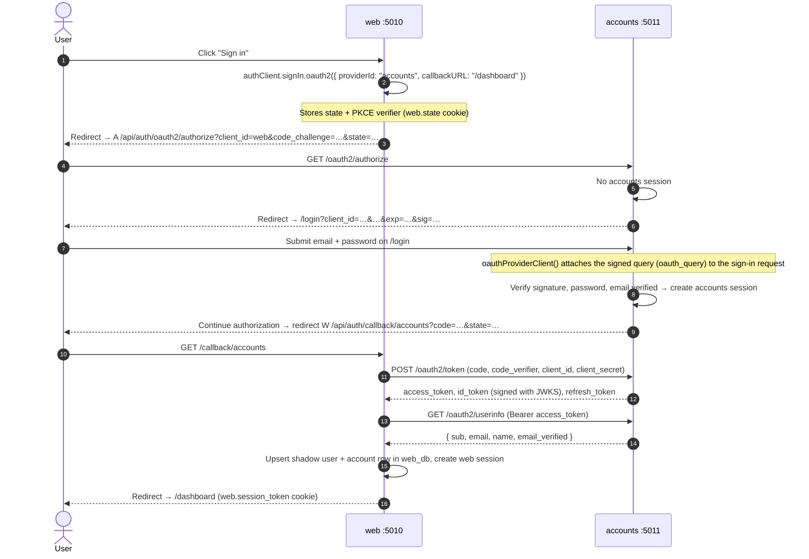
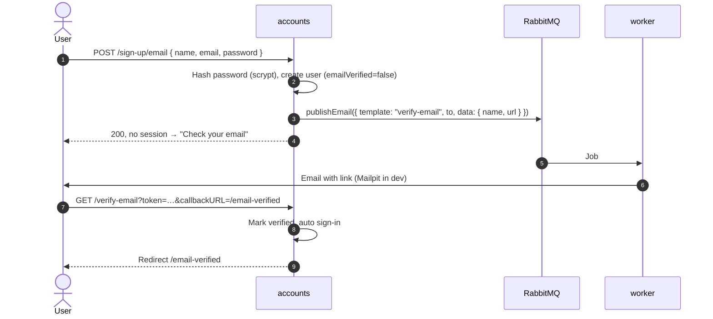

# Authentication Flows

How identity moves between services. Read [ARCHITECTURE.md](../ARCHITECTURE.md) first for the
service map.

> **Status:** the `accounts` side is built and verified (2026-10-06): authorize → `/login` with signed
> query → sign-in resumes → code → token exchange (PKCE, `client_secret_basic`) → userinfo; tampered
> query → `invalid_signature`. The `web` side is phase 6. Issuer is `http://localhost:5011/api/auth`;
> ID tokens are signed EdDSA (Ed25519).

---

## 1. Roles

| Service    | OAuth role                         | Better Auth plugins                                        |
| :--------- | :--------------------------------- | :--------------------------------------------------------- |
| `accounts` | Authorization server / OIDC provider | `emailAndPassword`, `emailVerification`, `jwt`, `oauthProvider`, `nextCookies` |
| `web`      | Relying party (OAuth client)        | `genericOAuth`, `nextCookies`                              |

`accounts` holds the only passwords. `web` never sees one: it receives an authorization code,
exchanges it for tokens server-to-server, and creates its own session.

---

## 2. Endpoints

All paths are under each service's `/api/auth` base.

### accounts (provider)

| Endpoint                                   | Method | Purpose                                                   |
| :----------------------------------------- | :----- | :-------------------------------------------------------- |
| `/.well-known/openid-configuration`         | GET    | OIDC discovery document. `web` reads endpoints from here. |
| `/oauth2/authorize`                         | GET    | Starts the authorization-code flow.                       |
| `/oauth2/token`                             | POST   | Exchanges a code (+ PKCE verifier) for tokens.            |
| `/oauth2/userinfo`                          | GET    | Returns `sub`, `email`, `name` for an access token.       |
| `/oauth2/end-session`                       | GET    | RP-initiated logout ("sign out everywhere").              |
| `/oauth2/revoke`, `/oauth2/introspect`      | POST   | Token revocation and introspection.                       |
| `/jwks`                                     | GET    | Public keys for verifying ID tokens.                      |
| `/sign-in/email`, `/sign-up/email`          | POST   | Password sign-in and sign-up.                             |
| `/verify-email`, `/send-verification-email` | GET/POST | Email verification and resend.                          |
| `/request-password-reset`, `/reset-password` | POST  | Password reset.                                           |

### web (client)

| Endpoint                    | Method | Purpose                                                    |
| :-------------------------- | :----- | :--------------------------------------------------------- |
| `/sign-in/oauth2`           | POST   | Starts the handshake with `providerId: "accounts"`.        |
| `/callback/accounts`        | GET    | Redirect URI registered with `accounts`.                   |
| `/get-session`, `/sign-out` | GET/POST | `web`'s own session.                                     |

---

## 3. Single Sign-On (first visit)

**Why the signed query matters:** the login page cannot be tricked into resuming an authorization
request someone else crafted. `accounts` signs the original query when it redirects to `/login`, and
rejects the sign-in if the signature or expiry does not verify. This replaces the manual
`window.location.href = "/api/auth/oauth2/authorize?…"` redirect philgeps uses.

---

## 4. Returning visit (already signed in to accounts)

Steps 5–7 above are skipped: `/oauth2/authorize` finds the accounts session and redirects straight
back to `web` with a code. To the user this is a one-click sign-in. `web` is a first-party client,
seeded with `skipConsent: true`, so no consent screen appears.

---

## 5. Sign-out

| Action                | What happens                                                                 |
| :-------------------- | :--------------------------------------------------------------------------- |
| Sign out of `web`     | `authClient.signOut()` deletes the `web` session only. Next sign-in is one click. |
| Sign out everywhere   | `web` also redirects to `accounts` `/oauth2/end-session` with the ID token hint, which ends the accounts session and returns to `web`. |
| Password reset        | `accounts` revokes all of the user's accounts sessions. Existing `web` sessions stay valid until they expire. |

> Back-channel logout (accounts telling every client to drop its sessions) is out of scope for v1.

---

## 6. Flows owned by `accounts`

These are ported from `next-betterAuth-monolith-template`. The difference is that email delivery
goes through the queue instead of an in-process `sendEmail()`.

### Sign-up and email verification

- Sign-in before verifying returns `EMAIL_NOT_VERIFIED`. `/login` offers a resend button.
- A duplicate sign-up gets the same response as a new one, so emails cannot be enumerated.
- If sign-up started from an OAuth handshake, the user finishes verification and then signs in
  from `web` again.

### Password reset

1. `/forgot-password` → `POST /request-password-reset { email, redirectTo: "/reset-password" }`.
2. `accounts` stores a token in `verification` (1 hour) and publishes a `reset-password` job.
   The response is identical whether or not the email exists.
3. The link hits `/reset-password/<token>` and redirects to `/reset-password?token=…`.
4. `POST /reset-password { token, newPassword }` updates the hash and revokes all sessions.

### Rate limits

| Path                       | Window | Max |
| :------------------------- | :----- | :-- |
| `/sign-in/email`           | 60 s   | 5   |
| `/sign-up/email`           | 60 s   | 3   |
| `/request-password-reset`  | 300 s  | 3   |
| `/reset-password`          | 300 s  | 5   |
| `/send-verification-email` | 300 s  | 3   |
| everything else            | 60 s   | 100 |

In-memory storage, per process. See [deployment.md](deployment.md) before running more than one instance.

---

## 7. Sessions and cookies

| Service    | Cookie prefix | Session lifetime                 | Checked by                         |
| :--------- | :------------ | :------------------------------- | :--------------------------------- |
| `accounts` | `accounts`    | 7 days, refreshed daily on use   | `requireAuth()` in `accounts`      |
| `web`      | `web`         | 7 days, refreshed daily on use   | `requireAuth()` in `web`           |

- On `localhost`, both apps share one cookie jar (cookies ignore ports), so the prefixes are what
  keep `accounts.session_token` and `web.session_token` apart.
- Protected pages call `requireAuth()`, which checks the session against the database, not just the
  cookie.
- The OAuth `state` cookie on `web` gets a 10-minute max age, so a slow login on `accounts` doesn't
  end in `state_mismatch` (a bug philgeps hit with the 5-minute default).

---

## 8. User data in `web`

`web` stores a shadow `user` row keyed by its own id, linked to `accounts` through
`account.providerId = "accounts"` and `account.accountId = <accounts user id>`.

- `overrideUserInfo: true` refreshes name and email from `accounts` on every sign-in, so an email
  change in `accounts` reaches `web` the next time the user signs in.
- App features in `web` reference `user.id` from `web_db`, never the accounts id directly.
